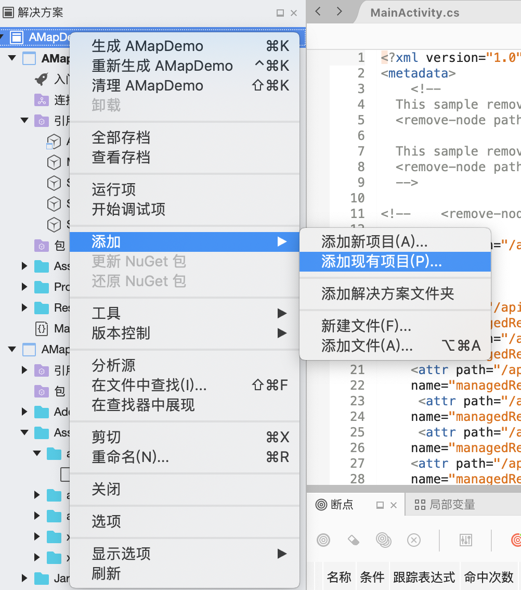
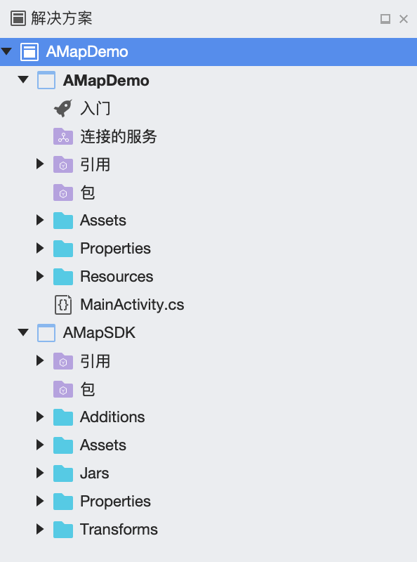
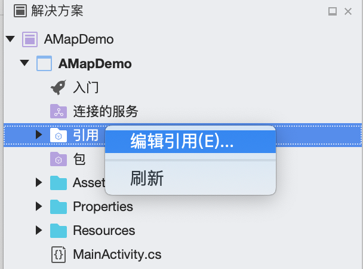
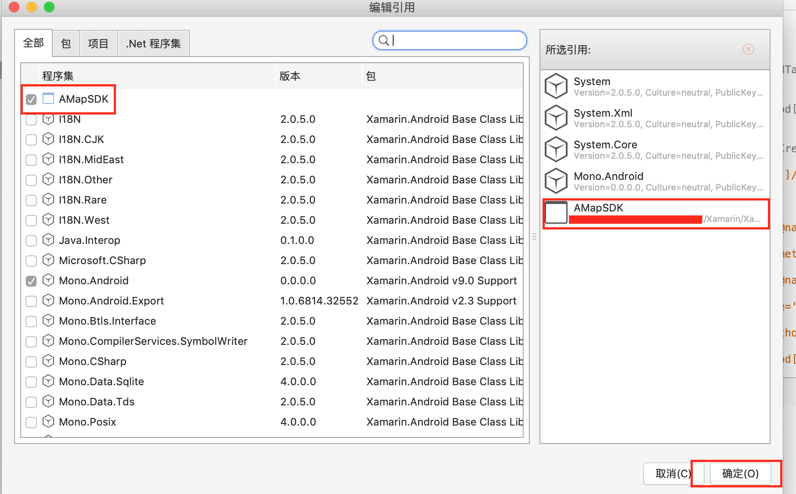
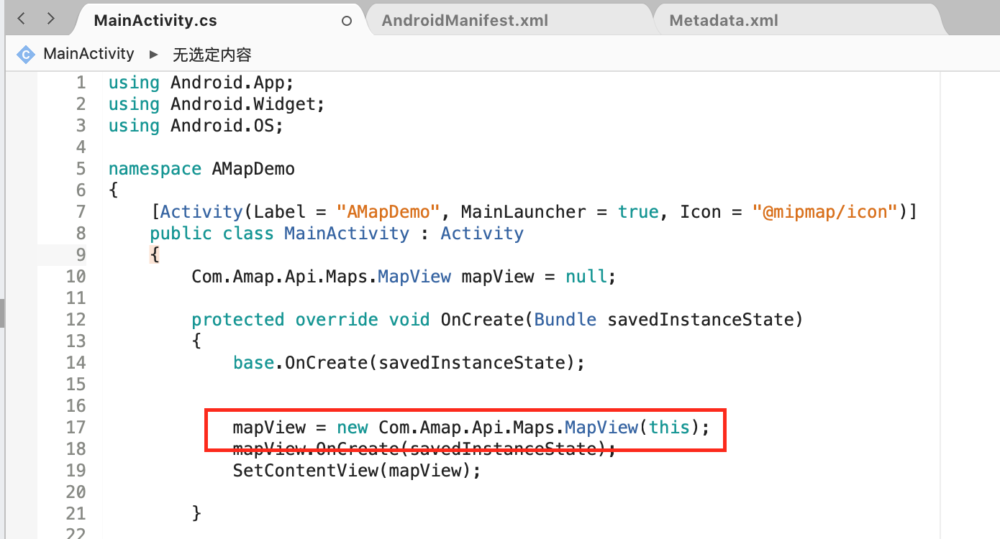
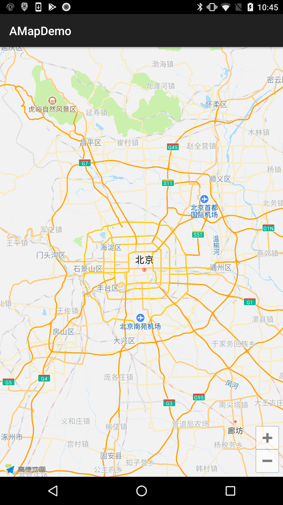

## Xamarin.Andorid 高德地图SDK

xamarin接入高德地图sdk示例，其中包含地图展示等基本功能

## 前述 ##
- [高德官网申请Key](http://lbs.amap.com/dev/#/).
- 阅读
  [地图SDK参考手册](http://a.amap.com/lbs/static/unzip/Android_Map_Doc/index.html). 
- 工程基于高德地图实现

## 使用方法 ##
### 配置搭建Xamarin.Andorid工程
1. [Xamarin官方步骤](https://docs.microsoft.com/en-us/xamarin/android/get-started/)

2. 添加现有项目
	拷贝**AMapSDK**到本地，在上一步创建的工程中引入**AMapSDK** （各VS版本有些差异，这里以VS for Mac 7.6.11 为例）

	**右击工程名称-->添加-->添加现有项目 操作步骤和效果如图所示**
	
	
	
	
	

4. 引用项目
	**右击工程中引用-->编辑引用-->勾选AMapSDK**
	
	

	

5. 编译写代码并运行

	

	

## 原生SDK细节 ##
[AMapSDK](AMapSDK/README.md)
